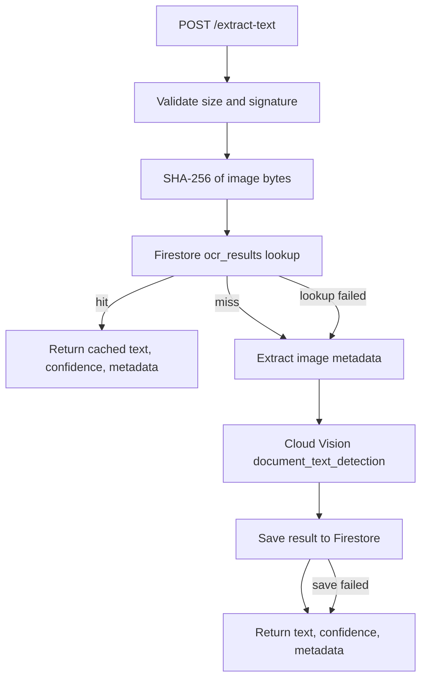
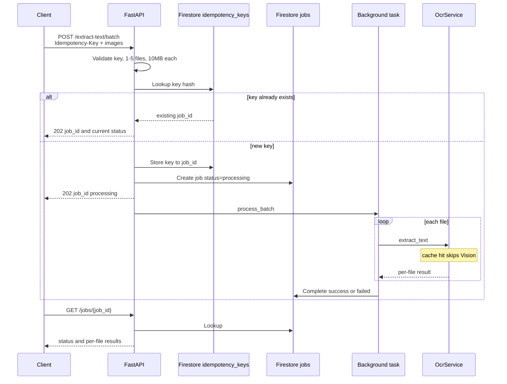

# fast-ocr

OCR API on FastAPI. Cloud Vision does the extraction. Firestore caches results and stores batch jobs.

Needs Python 3.11+, [gcloud](https://cloud.google.com/sdk/docs/install), and a GCP project.

## GCP (once per project)

```bash
export PROJECT_ID=fast-oct   # same value as GOOGLE_CLOUD_PROJECT in .env
gcloud config set project "$PROJECT_ID"

gcloud services enable vision.googleapis.com firestore.googleapis.com

gcloud firestore databases create \
  --location=nam5 \
  --type=firestore-native
```

Skip the Firestore command if a Native database already exists. Collections are created on first write.

Login so the app can call GCP from this machine:

```bash
gcloud auth application-default login
```


## Run

```bash
cp .env.example .env
```

Set `GOOGLE_CLOUD_PROJECT` to `$PROJECT_ID`. Leave `GOOGLE_APPLICATION_CREDENTIALS` unset.

```bash
python3 -m venv .venv
source .venv/bin/activate
pip install -r requirements.txt
uvicorn app.main:app --host 0.0.0.0 --port 8080 --reload
```

Swagger: [http://localhost:8080/docs](http://localhost:8080/docs)

ReDoc: [http://localhost:8080/redoc](http://localhost:8080/redoc)

```bash
curl -X POST -F "image=@sample-images/image1.JPG" http://localhost:8080/extract-text
```

Batch: 1–5 files, field name `images`. `Idempotency-Key` is required. Response is a `job_id`; poll until status is `success` or `failed`. Swagger cannot upload multiple files; use curl.

```bash
curl -X POST \
  -H "Idempotency-Key: $(uuidgen)" \
  -F "images=@sample-images/image1.JPG" \
  -F "images=@sample-images/image2.JPG" \
  http://localhost:8080/extract-text/batch

curl http://localhost:8080/jobs/{job_id}
```

## Live 

Live: [https://fast-ocr-ithnktbq2q-uc.a.run.app](https://fast-ocr-ithnktbq2q-uc.a.run.app)

Docs: [https://fast-ocr-ithnktbq2q-uc.a.run.app/docs](https://fast-ocr-ithnktbq2q-uc.a.run.app/docs)

Redoc: [https://fast-ocr-ithnktbq2q-uc.a.run.app/redoc](https://fast-ocr-ithnktbq2q-uc.a.run.app/redoc)

```bash
curl -X POST -F "image=@sample-images/image1.JPG" https://fast-ocr-ithnktbq2q-uc.a.run.app/extract-text
```


```bash
curl -X POST \
  -H "Idempotency-Key: $(uuidgen)" \
  -F "images=@sample-images/image1.JPG" \
  -F "images=@sample-images/image2.JPG" \
  https://fast-ocr-ithnktbq2q-uc.a.run.app/extract-text/batch

curl https://fast-ocr-ithnktbq2q-uc.a.run.app/jobs/{job_id}
```

## Caching

Identical images skip Vision. The cache key is the SHA-256 of the file bytes. Document id in Firestore `ocr_results` is that hash. Cache misses call Vision, then write the result. Lookup or save errors are logged and OCR still runs.



## Batch processing

`POST /extract-text/batch` accepts 1–5 files and requires `Idempotency-Key`. The first request creates a Firestore job (`status: processing`) and returns `202` with a `job_id`. The same key returns that job without starting another run. Work runs in a background task; each file uses the same hash cache as `/extract-text`. Poll `GET /jobs/{job_id}` until `success` or `failed`.




